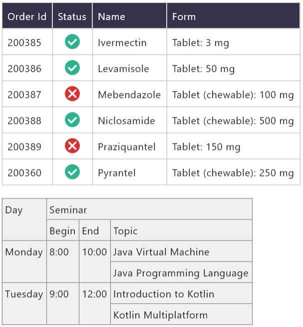

#  compose-table
[](https://maven-badges.herokuapp.com/maven-central/com.github.zakgof/compose-table)
[](http://kotlinlang.org)
![badge][badge-android]
![badge][badge-ios]
![badge][badge-jvm]
![badge][badge-linux]
![badge][badge-mac]
![badge][badge-wasm]
![badge][badge-windows]

Table component for Kotlin Multiplatform

`@Composable` table widget

- Automatic layout
- Composable cells
- Grid lines
- Spanning rows and columns
- Easy to use

  

## Setup
Gradle configuration for Kotlin Multiplatform:

```kotlin
kotlin {
    sourceSets {
        commonMain.dependencies {
            implementation("com.github.zakgof:table:1.0.0")

```

## Quick start
```kotlin
Table (lineWidth = 2.dp, lineColor = Color.BLUE) {
    Row {
        Text(text = "Cell 1")
        Text(text = "Cell 2")
    }
    Row {
        Text(text = "Long cell", modifier = Modifier.columnSpan(2))
    }
}
```

[badge-android]: http://img.shields.io/badge/-android-6EDB8D.svg?style=flat
[badge-jvm]: http://img.shields.io/badge/-jvm-DB413D.svg?style=flat
[badge-linux]: http://img.shields.io/badge/-linux-2D3F6C.svg?style=flat
[badge-windows]: http://img.shields.io/badge/-windows-4D76CD.svg?style=flat
[badge-wasm]: https://img.shields.io/badge/-wasm-624FE8.svg?style=flat
[badge-ios]: http://img.shields.io/badge/-ios-CDCDCD.svg?style=flat
[badge-mac]: http://img.shields.io/badge/-macos-111111.svg?style=flat
